# JxAgent

**Regression-aware post-training for reliable long-horizon computer use agents.**

JxAgent is an experimental research project for improving an already capable multimodal model on difficult desktop-agent behavior while explicitly measuring and limiting regression outside the specialization target.

The current runnable target is **`Qwen/Qwen3.8-27B`**, the official open-weight multimodal Qwen 3.8 27B release. JxAgent is deliberately model-specific: before any production-sized build, the repository requires a native interface contract to be frozen from the exact local model and processor revision used for training and evaluation.

> **Research status:** infrastructure and second-stage data hardening are implemented. No final model-quality result is claimed yet. The next phase is controlled GPU training, checkpoint-by-checkpoint regression evaluation, and ablation.

## Research question

Can targeted post-training improve recovery, verification, action grounding, loop avoidance, save/export workflows, dialogs, exact-quantity tasks, multi-target tasks, and long-horizon desktop reliability **without measurably degrading the base model's general instruction following, coding, math, multimodal understanding, native tool use, style, safety, or long-context behavior?**

## Why JxAgent exists

Computer-use models can fail in ways that ordinary next-action accuracy hides. A model may click correctly most of the time but still loop after an ineffective action, stop without verifying success, mishandle dialogs, lose track of multi-app state, or regress on capabilities it already had before specialization.

JxAgent treats the project as a **minimal behavioral delta** problem. The goal is not to replace the base model's distribution. The goal is to add narrow, measurable reliability improvements.

## Current pipeline

```mermaid
flowchart LR
    A[Public CUA datasets] --> B[Streaming source adapters]
    B --> C[Coordinate and image normalization]
    C --> D[Quality and evidence gates]
    D --> E[Dedup and OSWorld decontamination]
    E --> F[Best-valid global selection]
    F --> G[Group-aware split]
    G --> H[Native-interface freeze]
    H --> I[Preproduction SFT]
    I --> J[Paired base vs adapter evaluation]
    J --> K[Keep Pareto-safe checkpoint]
```



### Planned 95,503-sample Run 1 mixture

| Source | Selected target | Primary role |
| --- | ---: | --- |
| NVIDIA ProCUA-SFT | 46,000 | desktop action trajectories |
| GUI-360 Lite | 16,000 | action use, grounding, screen understanding |
| ServiceNow VideoCUA | 17,500 | temporal desktop behavior |
| ServiceNow GroundCUA | 4,000 | difficult UI grounding |
| PC-Agent-E | 4,503 | desktop action trajectories |
| General replay | 7,500 | preservation for coding, math, instruction, VQA, tools |
| **Total** | **95,503** | |

The dataset builder does **not** include OSWorld or OSWorld Verified trajectories as training data. Public OSWorld instructions are used only as a contamination reference and held-out evaluation remains separate.

## What is already implemented

- streaming and range-based source access to avoid mirroring very large upstream datasets
- explicit coordinate conversion into final image space
- RGB image parity and lossless WebP for GUI supervision
- small-target preservation and bounding-box validation
- evidence-gated `finish` supervision
- recovery supervision from real state transitions without synthetic chain-of-thought
- best-valid global sample selection instead of first-valid selection
- task-motif coverage floors for dialogs, save/export, file chooser, overwrite, exact quantity, sort/rank, multi-target, drag, hotkeys, scroll/read, settings, recovery, verification, and cross-app tasks
- group-aware train/validation splitting
- OSWorld contamination checks
- loss-token accounting scaffolding
- model-native interface freeze that fails closed for production-sized builds
- MI300X training scripts with smoke, throughput, resume, and explicit full-train confirmation gates
- base-versus-adapter evaluation scaffolding
- offline automated tests with synthetic fixtures

## The regression problem

A correct specialized dataset can still damage a strong base model. JxAgent therefore treats preservation as a release condition, not an assumption.

The current highest-priority research work is a contained Regression Guard layer covering:

1. executable train/eval protocol parity
2. exact trainer-label accounting
3. a combined auxiliary-loss cap and a core computer-use action floor
4. native replay tool formatting
5. explicit thinking and generation-prefix policy
6. architecture-aware LoRA target auditing
7. frozen preservation canaries
8. truly paired base-versus-adapter evaluation by sample ID
9. train/validation distribution-parity checks
10. preservation of all preproduction checkpoints for Pareto selection
11. serving-parity measurements

See [`docs/REGRESSION_GUARD.md`](docs/REGRESSION_GUARD.md).

## Quick start

### Local test environment

```bash
python -m venv .venv
# Windows: .venv\Scripts\activate
# Linux/macOS: source .venv/bin/activate
python -m pip install -r requirements.txt
python -m pytest tests/ -q
```

### Small smoke build

Small builds do not require local model weights and are intended only to validate source adapters and data invariants.

```bash
python build_jxagent_dataset.py \
  --output ./SmokePC \
  --sources pcagente \
  --pcagente-count 20 \
  --smoke
```

### Production-sized build

A build of 5,000 samples or more fails closed unless a verified native-interface manifest is supplied. Do not bypass this gate for a real training run.

```bash
python build_jxagent_dataset.py \
  --output ./JxAgentData_Run1 \
  --interface-manifest /path/to/jxagent_interface_manifest.json \
  --sources pcagente groundcua gui360 replay videocua procua \
  --pcagente-count 4503 \
  --groundcua-count 4000 \
  --gui360-count 16000 \
  --replay-count 7500 \
  --videocua-count 17500 \
  --procua-count 46000
```

## GPU training

The repository contains a guarded AMD MI300X path under [`mi300x/`](mi300x/). Full training is intentionally never started automatically.

Expected order:

```text
setup
preflight
download_model
freeze/verify native interface
inspect LoRA modules
download and validate prepared dataset
3-step smoke train
100-step throughput test
manual review of estimate and gates
explicitly confirmed full train
paired evaluation
```

The training recipe is currently LoRA with BF16, one epoch, gradient checkpointing, an effective global batch near 32, and module selection derived from the actual downloaded model architecture rather than guessed projection names. See [`configs/training.yaml`](configs/training.yaml).

## Evaluation policy

JxAgent separates three questions:

1. **Did computer-use behavior improve?**
2. **Did any preserved capability regress?**
3. **Is the improvement worth the compute and serving cost?**

The release target is a Pareto improvement or a deliberately bounded tradeoff, never a checkpoint selected only because one desktop benchmark increased.

Planned reporting includes action validity, grounding, task success, recovery success, premature stopping, loops, calibration, latency, throughput, peak VRAM, and paired preservation deltas.

## Repository map

```text
JxAgent/
├── build_jxagent_dataset.py
├── sources/                 # upstream source adapters
├── processing/              # normalization, selection, quality, splits
├── evaluation/              # base/adaptor comparison and OSWorld scaffold
├── mi300x/                  # guarded ROCm training workflow
├── tools/                   # audits, interface freeze, accounting
├── tests/                   # offline test suite
├── configs/                 # dataset, training, native contract templates
├── audit_independent/       # read-only final dataset audit tooling
└── docs/                    # research, data, compute, evaluation documentation
```

## Reproducibility and claims

JxAgent intentionally distinguishes engineering validation from model-quality evidence.

- passing unit tests do not prove model quality
- a remote GPU smoke run does not prove benchmark improvement
- mock or synthetic success is not reported as live task success
- benchmark results are published only with frozen sample IDs, configuration, model revision, and run artifacts
- negative and regressed checkpoints are useful research results and should be retained

## Public research output

The intended outputs are source code, experiment configuration, training methodology, data-selection methodology, hardware/compute measurements, ablations, failure analysis, and validated benchmark results.

This repository contains **pipeline code, tests, and documentation only**. It does not redistribute upstream datasets, model weights, credentials, private trajectories, or benchmark evaluation assets.

## Related work

JxAgent builds on the same broader research direction as [`JxAgentReal/JxMinecraftAgent`](https://github.com/JxAgentReal/JxMinecraftAgent), a separate long-horizon agent project exploring planning, validated execution, memory, trajectory collection, replay, recovery, and macro-level reinforcement learning.

## License

Project source code is released under the Apache License 2.0. Upstream datasets and models retain their own licenses. See [`docs/THIRD_PARTY_DATA.md`](docs/THIRD_PARTY_DATA.md) before building or redistributing any derived dataset.

## Lambda/NVIDIA reproducibility path

For NVIDIA cloud experiments, including a Lambda Research Grant allocation, see [`cloud/README.md`](cloud/README.md) and the bounded [`cloud/lambda_preflight.sh`](cloud/lambda_preflight.sh). The cloud path is designed to preserve the same data and evaluation contracts as the AMD MI300X workflow while recording accelerator-specific throughput and memory measurements.
